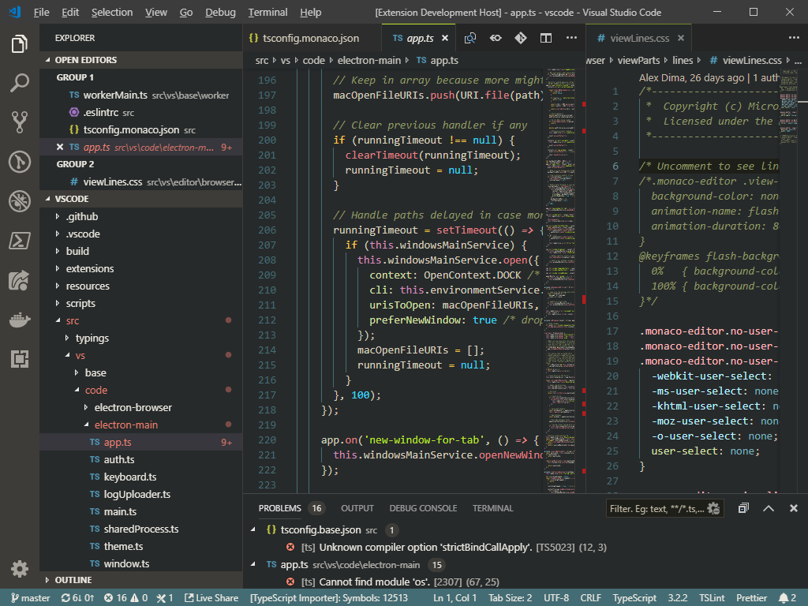
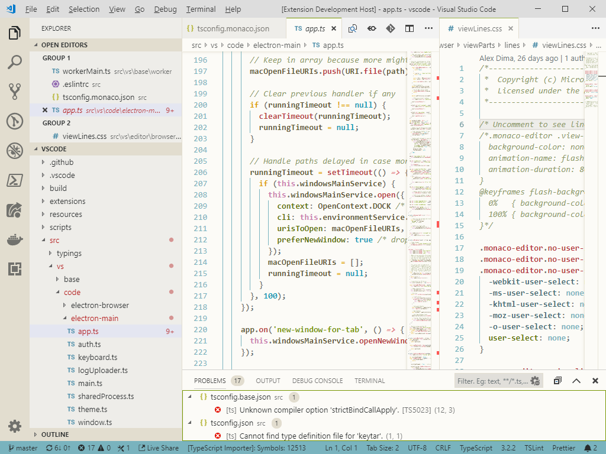
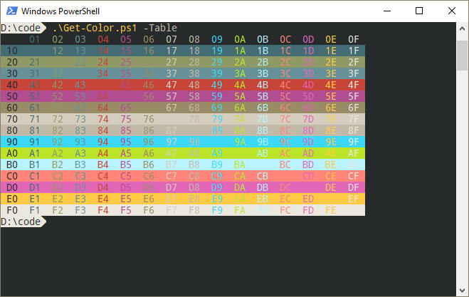

# Bombyx

This is a dark color scheme I've been using and refining for a while, and a light variation. It's warm and muted, with harmonious jewel-like highlights.

Since it reminded me of antique silk embroidery, I named it after the genus of the silk moth, _Bombyx mori_.

It's based around five hue values: 43° (yellow / brown), 73° (green / olive), 190° (blue / teal), 320° (pink / purple), and 356° (red / rose). These hues, in various shades, make up the whole palette, from near-black to off-white.

## Visual Studio Code

Install from [Visual Studio Marketplace](https://marketplace.visualstudio.com/items?itemName=y6nH.bombyx).

To install from source, make a new folder inside `~/.vscode/extensions/`, and copy in the file `vscode/themes/Bombyx.color-theme.json` from this project. Restart VSCode, and it should appear in your Color Theme list.

## Concfg for Windows command line

To get the Windows CMD and Powershell windows styled with Bombyx colors, install [Concfg](https://github.com/lukesampson/concfg) and run `concfg import bombyx`. I like to use it with [Pshazz](https://github.com/lukesampson/pshazz) and the [Noto Mono for Powerline](https://github.com/powerline/fonts/tree/master/NotoMono) font.

## Other shells, terminals, consoles and editors

You can use [terminal.sexy](http://terminal.sexy/) to generate themes in various formats. Import the [xresources file](terminal.sexy/terminal.sexy.xresources.txt) and then export in the appropriate format.
