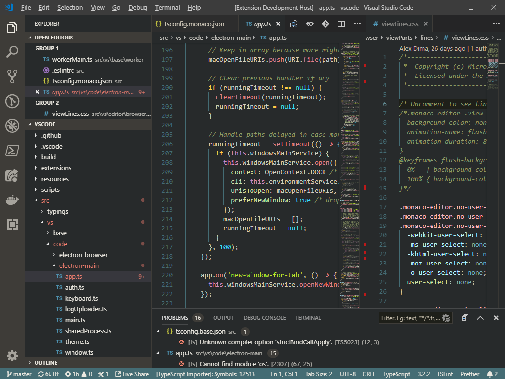

# Bombyx

This is a color scheme I've been using and refining for a while. It's warm and muted, with harmonious jewel-like highlights.

Since it reminded me of antique silk embroidery, I named it after the genus of the silk moth, _Bombyx mori_.

The Visual Studio Code version includes colors for the application UI as well as for source code and console text.

